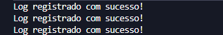
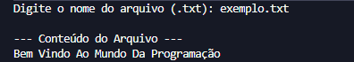
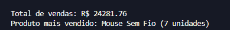

# 🐍 Exercícios Avançados em Python

Repositório criado para praticar conceitos mais avançados da linguagem Python, envolvendo manipulação de arquivos, tratamento de erros, leitura de dados e automações simples.

---

## 📚 Conteúdo do repositório

Os exercícios deste repositório possuem foco em desenvolver soluções mais completas, organizadas e próximas de aplicações reais.

### Exercícios disponíveis

* 📝 Registro de Logs
* 📄 Leitor de Arquivos Texto
* 📊 Análise de Arquivos CSV

---

## 🚀 Tecnologias utilizadas

* Python 3
* Módulo `datetime`
* Módulo `csv`
* Tratamento de erros (`try/except`)
* Modulo tkinter
---

## 🎯 Objetivo

Este repositório faz parte da construção do meu portfólio no GitHub e da evolução dos meus conhecimentos em Python.

Os exercícios têm como objetivo praticar:

* Manipulação de arquivos
* Leitura de arquivos `.txt`
* Leitura e análise de arquivos `.csv`
* Registro de logs
* Tratamento de exceções
* Organização de código
* Automações simples
* Estruturação de programas em Python

---

## 📸 Screenshots

### 📝 Registro de Logs



---

### 📄 Leitor de Arquivos Texto



---

### 📊 Análise de Arquivos CSV



---

## ▶️ Como executar os exercícios

1. Clone este repositório
2. Abra a pasta do projeto
3. Execute o arquivo desejado

Exemplo:

```bash id="jv5efl"
python analise_csv.py
```

---

## 📁 Estrutura do projeto

```text id="p52yxg"
python-exercicios-avancados/
│
├── README.md
├── registro_logs.py
├── leitor_texto.py
├── analise_csv.py
│
├── exemplos/
│   ├── exemplo.txt
│   └── vendas.csv
│
└── assets/
    ├── registro_logs.png
    ├── leitor_texto.png
    └── analise_csv.png
```

---

## 📌 Observações

Novos exercícios e melhorias poderão ser adicionados conforme a evolução dos estudos em Python.

---

## 👨‍💻 Autor

Lucas Santos
Estudante de Análise e Desenvolvimento de Sistemas.
